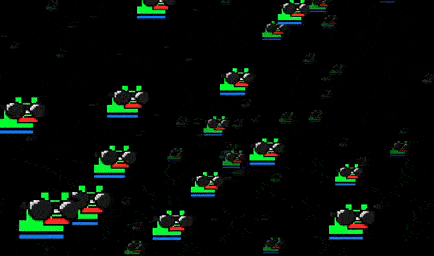

# hyperspace

A screensaver or demoscene, whatever, that opens you up to a new space, hyperspace.
Made with [Raylib](https://raylib.com) and the C programming language.



## Compile from sources

```bash
mkdir build && cd build
cmake ..
make
```

## Customization

+ You can replace the star image by placing the `star.png` file along with the executable. 

## License

See [LICENSE](LICENSE). This project is under the WTFPL license.